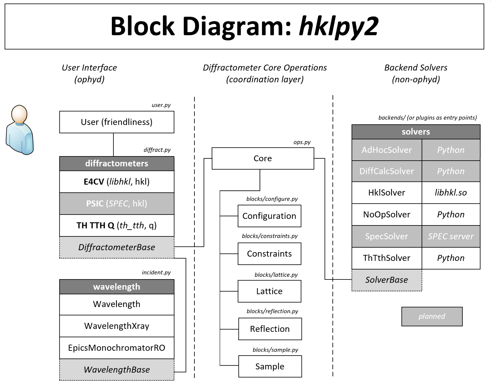

# Design for hklpy2

Gather the discussion points, thoughts, issues, etc. for development of
[*hklpy2*](https://github.com/prjemian/hklpy2), the second generation of
the [*hklpy*](https://github.com/bluesky/hklpy) package.

Here's a block diagram of the new API:

## hklpy release v2.0 project

As stated in the [project](https://github.com/orgs/bluesky/projects/4/settings):

Redesign of the Diffractometer object.

- user-requested changes
- move libhkl to be a replaceable back-end computation library
- easy to save/restore configuration
- easy to use different *engines* (such as `hkl`, `qper_qpar`, `emergence`, ...)
- user can choose different names for any of the diffractometer axes

## Design ideas

This is a starting format for suggestions, but it may become clear that a different format to describe our requirements is necessary.

1. Default diffractometer geometries
1. Bragg Peak optimization tools
1. Defining orientation matrix or matrices
1. Simulating diffraction and diffractometer modes
1. Built in reciprocal space plans (or scans)
1. Choice of calculation engines other than the hkl C package

## Review of terminology coordinate systems

- $B$ goes from *hkl* to an orthonormal basis in the crystal reference frame
- $U$ goes from the crystal reference frame to the reciprocal lab frame (expressing how the crystal is stuck onto the diffractometer)
- Solving the diffractometer equation goes from the reciprocal lab frame to diffractometer angles. (Some people loosely call this "real space" but perhaps they shouldn't. It's angles.)

## Desired API

The desired "solver API" into the HKL computation code should be transformations 
from reciprocal space to diffractometer angle space and vice versa, each taking
three arguments:

- a structure (dict or struct) describing a geometry (motors, reference positions, and constraints)
- observed mapping between real and reciprocal space to give you the "U" of the UB matrix
- the crystallography to give you the "B"

Underneath this API could be many different solvers:

- custom project
- pybind-wrapped components from `libhkl`
- SPEC

It should be easy to switch between solvers at run time so that new things can be validated.

## Support for Additions

- [analyzers and polarizers](https://github.com/bluesky/hklpy/issues/92)

  Perhaps everything is already in place to support these items as stand alone
  ophyd objects. Here is what's needed:

  - [ ] Identify if we are missing items to support analyzers or polarizers
  - [ ] Make sure we don't over specify requirements to cause problems for analyzers or polarizers
  - [ ] Do we need to tie these new ophyd objects together with diffractometer object?  
          What is the best way to do that?

- Make it easy to provide additional axes, such as for:
  - rotation about arbitrary vector
  - Solvers with different reciprocal-space axes
  - extra parameters, as required by solver
    (For example, see `emergence` mode in
    [E4CV](https://blueskyproject.io/hklpy/geometry_tables.html#geometry-e4cv))

## Reflections

- [write orientation reflections with scan](https://github.com/bluesky/hklpy/issues/158), 
  [also](https://github.com/bluesky/hklpy/issues/247)
- [identify orientation reflections](https://github.com/bluesky/hklpy/issues/176)
- [`cahkl()` should make nice report when reflection can't be reached](https://github.com/bluesky/hklpy/issues/178)
- [reflection is a Python class](https://github.com/bluesky/hklpy/issues/189)
- [`addReflection()`, when to use current positions](https://github.com/bluesky/hklpy/issues/219)
- [avoid duplications](https://github.com/bluesky/hklpy/issues/248)
- [label each reflection](https://github.com/bluesky/hklpy/issues/293)

## Other

- [modify existing sample](https://github.com/bluesky/hklpy/issues/157)
- [control display precision in `wh()` and `pa()`](https://github.com/bluesky/hklpy/issues/179)
- [crystallographic *zones*](https://github.com/bluesky/hklpy/issues/291)

## Sources

As listed in *hklpy* issues:

- [design conversation for an hkl solver API](https://github.com/bluesky/hklpy/issues/14)
- [requirements RFP](https://github.com/bluesky/hklpy/issues/47)
- [requirements](https://docs.google.com/document/d/1QHNc1usAH3DoIHvtqVJTmHI0Q5lbwC4zimRLurOGiWE/edit)

## Additional Solvers

As listed in *hklpy* issues.

- [*ad-hoc* geometries](https://github.com/bluesky/hklpy/issues/244)
- [diffcalc](https://github.com/bluesky/hklpy/issues/163)
- [TwoC unknown](https://github.com/bluesky/hklpy/issues/165)
- [xrayutilities](https://github.com/bluesky/hklpy/issues/162)
- SPEC server

## Python entrypoints

Could be used for [backend solvers](https://github.com/bluesky/hklpy/issues/161)

> It provides an useful tool for pluggable Python software development.

- [Article with example](https://stackoverflow.com/a/9615473/1046449) about entrypoints.
- [Demo](https://github.com/RichardBronosky/entrypoint_demo) (9 years old)

See the docs in setuptools regarding [*Entry Points for
Plugins*](https://setuptools.pypa.io/en/latest/userguide/entry_point.html#entry-points-for-plugins).

## Differences between hklpy v1 & hklpy2 v2

### hklpy v1

- Depends on **libhkl**:
  - Only compiled for linux-x86_64
  - Difficult to modify existing (or add additional) diffractometer geometries.
  - All samples, lattices, & reflections are stored by the **libhkl** library.
  - Multiple layers (diffractometer, calc, engine, sample), based on **libhkl** design.
    - Layer design is confusing as to where a feature is implemented.
    - Users are often tempted to dig into lower layers for features.
  - Difficult to use additional diffractometer axes and parameters.
- Uses **libhkl** as the *defining reference* for diffractometer data and operations.

### hklpy2 v2

- Samples, lattices, & reflections stored in Python.
- Separate the roles of operator and solver.
  - Operator makes *transactions* with the selected *solver*.
  - For specific operations, *solver* is setup and then *operated*.
- Refactor use of **libhkl** as a backend *solver* library.
- Support additional backend *solver* libraries.
- Simpler design.
